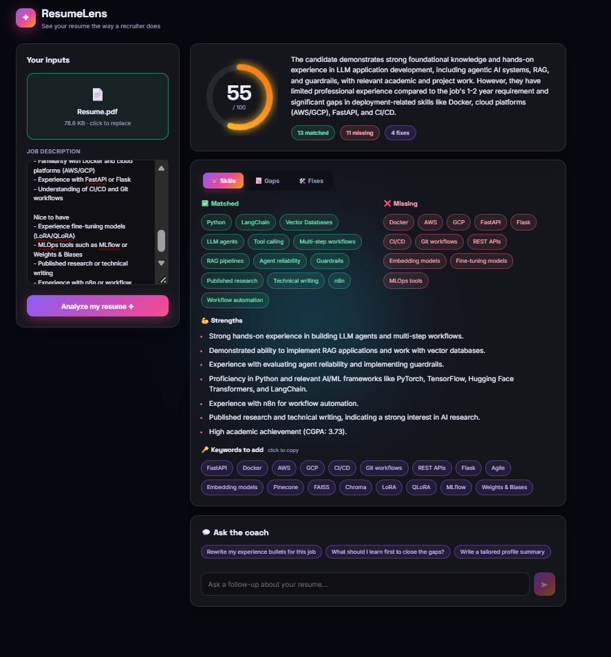

# ResumeLens ✦

**An AI resume analyzer that compares your resume against a job description and returns a structured breakdown: match score, matched and missing skills, experience gaps, and specific fixes.**



## What it does

Upload a resume (PDF or DOCX), paste a job description, and get:

- **Match score** (0-100) with an animated ring
- **Matched skills**: what the job asks for and your resume actually shows
- **Missing skills**: what the job asks for and your resume lacks
- **Experience gaps**: seniority, years, and responsibilities
- **Strengths** and **ATS keywords** to add (click a keyword to copy it)
- **Fix checklist** with replacement wording, filterable by resume section
- **AI coach chat** for follow-ups like "rewrite my experience bullets for this job"

## How it works

```
React UI  ──►  FastAPI  ──►  text extraction (pypdf / python-docx)
                        └──►  Gemini  ──►  Pydantic-validated JSON  ──►  UI
```

**Structured outputs.** Instead of asking the model for free-form advice, the app passes a Pydantic schema to the Gemini API, so every response arrives as validated JSON with fixed fields (`matched_skills`, `missing_skills`, `experience_gaps`, `recommended_improvements`, and so on). The UI renders those fields directly, so there's no text parsing, and malformed output gets caught instead of crashing the app.

**Prompt design.** The system prompt was tuned by running the same resume against several job descriptions (a strong fit, a partial fit, and a deliberately bad fit) and checking for:
- **Hallucinated skills**: a skill counts as matched only if the resume names it or clearly describes using it
- **Scoring consistency**: repeated runs land within a few points of each other
- **Clean output**: short skill names, no duplicates, and experience/seniority points kept out of the skills lists
- **Correct dates**: the model is given today's date, so it doesn't flag recent resume dates as typos

## Tech stack

| Layer | Tools |
|---|---|
| Frontend | React (Vite), plain CSS |
| Backend | Python, FastAPI, Uvicorn |
| AI | Google Gemini API (`gemini-2.5-flash`), structured output |
| Validation | Pydantic |
| File parsing | pypdf, python-docx |

`app.py` is the original Streamlit prototype, kept as a lightweight alternative UI.

## Run it locally

**Prerequisites:** Python 3.10+, Node.js 18+, and a [Gemini API key](https://aistudio.google.com/).

```bash
# 1. Clone
git clone https://github.com/AmanMalik2004/Resume-Analyzer.git
cd Resume-Analyzer

# 2. Backend setup
python -m venv venv
# Windows: venv\Scripts\activate     Mac/Linux: source venv/bin/activate
python -m pip install -r requirements.txt

# 3. Add your API key
cp .env.example .env        # Windows: copy .env.example .env
# then edit .env and set GEMINI_API_KEY

# 4. Start the API (terminal 1)
python -m uvicorn api:app --reload --port 8000

# 5. Start the frontend (terminal 2)
cd frontend
npm install
npm run dev
```

Open http://localhost:5173.

To use the Streamlit prototype instead: `python -m streamlit run app.py`

## Project structure

```
├── api.py           # FastAPI endpoints: /api/analyze and /api/chat
├── analyzer.py      # Prompt + Gemini calls (analysis and follow-up chat)
├── models.py        # Pydantic schema for the structured output
├── extract.py       # PDF and DOCX text extraction
├── app.py           # Streamlit prototype
└── frontend/        # React app (Vite)
```

## Limitations

- Scanned or image-only PDFs can't be read (there's no OCR yet)
- Legacy `.doc` files aren't supported; save as `.docx` or PDF
- Scores are model judgments. Treat them as a guide, not a verdict

## Ideas for next

- Downloadable PDF report
- "Rewrite my resume for this job" button
- OCR for scanned resumes
- Deployment (Render + Vercel)

## Author

Built by [Aman Malik](https://github.com/AmanMalik2004).